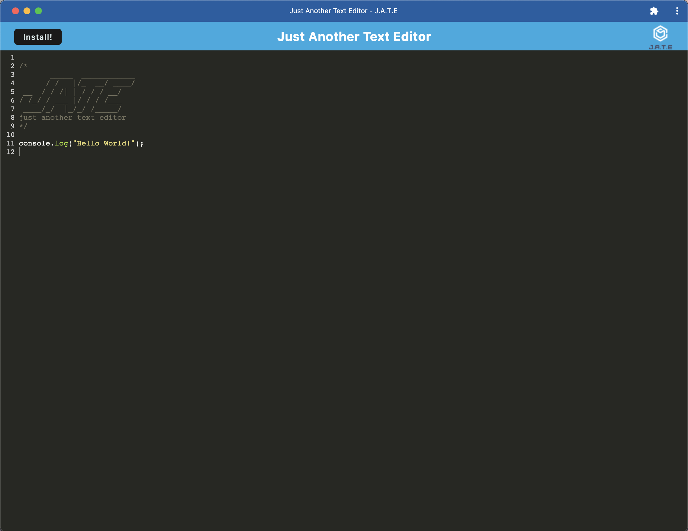

# Text Editor  
## Badges  
    
## Description  
  

This is a PWA (Progressive Web App) text editor that runs on a single page in the browser.  This application features a number of data persistence techniques that serve as redundancy in case one of the options is not supported by the browser.  This application also functions offline.

This application was created using technologies such as:
* JavaScript
* Node
* Express
* Babel
* CSS-loader
* Style-loader
* Webpack
* Workbox
* Idb

Some of the methods used in creating this application were found from resources such as W3Schools, MDN Web Docs, and Stack Overflow.   
[Link to Deployed App](https://text-editor-jae.herokuapp.com/)  
[Link to GitHub Repository](https://github.com/ahnjaeyung/Text_Editor)  
## Table of Contents  
  - [Badges](#badges)  
  - [Description](#description)  
  - [Installation](#installation)  
  - [Usage](#usage)  
  - [Credits](#credits)  
  - [License](#license)  
  - [How to Contribute](#how-to-contribute)  
  - [Tests](#tests)  
  - [Questions](#questions)  
## Installation  
Clone repo, npm i, npm run build  
## Usage  
To begin, the user must first install all necessary packages and dependencies (`npm run install`).  The user can then launch the application through the command line (`npm run start`).  

The user can install this application onto their desktop by clicking the *Install!* button on the top left corner of the page.

## Credits  
Jae Ahn
## License  
Read about MIT License:  
[MIT License](https://opensource.org/licenses/MIT)  
## How to Contribute  
Do not contribute.  
## Tests  
Do not test.
## Questions
For any questions, reach me at: [ahnjaeyung](https://github.com/ahnjaeyung),  
or email me at: ahn.jaeyung@gmail.com.